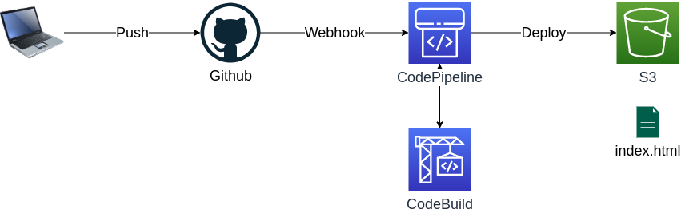

.. arai-sample-project documentation master file, created by
   sphinx-quickstart on Wed Feb 19 19:23:03 2020.
   You can adapt this file completely to your liking, but it should at least
   contain the root `toctree` directive.

Welcome to arai-sample-project's documentation!
===============================================

.. toctree::
   :maxdepth: 2

   :caption: Contents:

Image
----------------

PlantUML
----------------
.. uml::
  :align: center
  
  Alice -> Bob: Hi!
  Alice <- Bob: How are you?

Indices and tables
==================

* :ref:`genindex`
* :ref:`modindex`
* :ref:`search`
